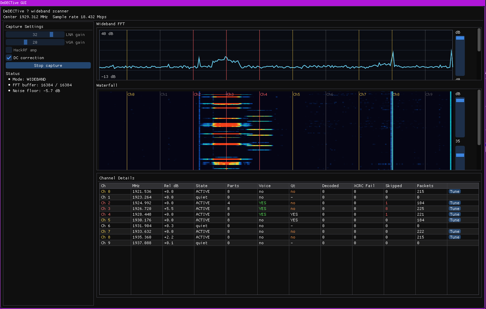
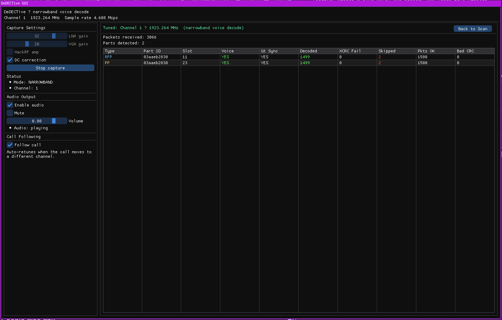
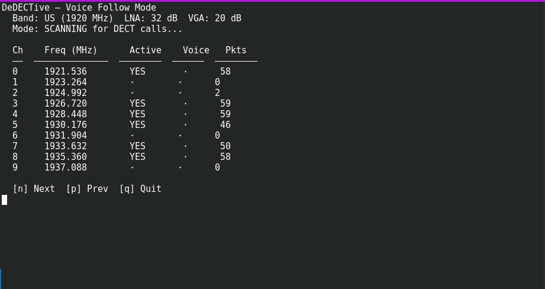
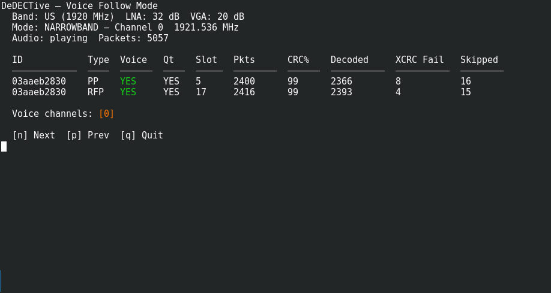
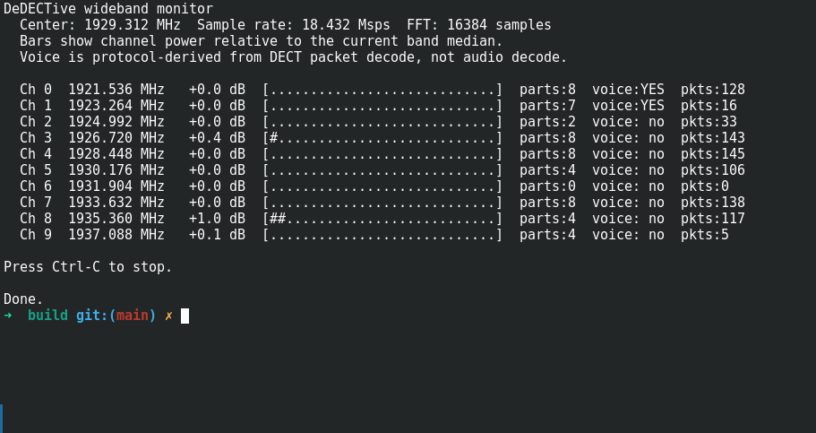

# DeDECTive.  WIP android port?

> **⚠️ Legal Warning**
>
> Intercepting or decoding wireless communications you are not authorized to access may violate federal, state, and local laws, including the U.S. Electronic Communications Privacy Act (18 U.S.C. § 2511) and equivalent laws in other jurisdictions. **This software is intended for use in controlled lab/test environments only.** The author takes no responsibility for how this software is used. By using DeDECTive, you accept full legal responsibility for your actions.

`DeDECTive` is a Linux-based DECT 6.0 scanner and voice decoder for the HackRF One. It includes both a Dear ImGui GUI and a terminal CLI — no GNU Radio required.

## GUI

### Wideband Scanner

Captures the entire DECT band (US or EU) in a single HackRF pass at 18.432 Msps with live FFT, waterfall, and per-channel activity/voice detection.



- Live FFT and waterfall display with adjustable dB range sliders
- Per-channel activity detection with hysteresis for stable readings
- Per-channel DECT packet decode showing RFP/PP parts, voice presence, and Qt sync status
- Channel details table with one-click **Tune** buttons to switch to narrowband

### Narrowband Voice Decode

Tunes to a single DECT channel for full G.721 ADPCM voice decode with RFP + PP audio mixed into one stream.



- G.721 ADPCM decoding of both RFP (base station) and PP (handset) audio
- RFP + PP audio mixed so both sides of the call are heard simultaneously
- Real-time PulseAudio playback with volume control
- Timeslot tracking (slots 0–11 downlink, 12–23 uplink)
- Sequence gap filling with G.721 comfort noise for smooth audio
- **Follow Call** — auto-retunes when a call moves to a different channel; returns to wideband scan after 2 seconds of silence

## CLI

### Voice Follow (default)

Run `dedective` with no flags to enter voice-follow mode. It scans the full band for DECT calls and automatically tunes to the first active voice channel.



Once a call is found, it switches to narrowband and plays decoded audio via PulseAudio. Both RFP and PP sides are mixed. When the call ends, it returns to scanning.



**Keyboard:** `n` next voice channel · `p` previous · `q` quit

### Wideband Monitor (`-W`)

A text-based wideband monitor showing per-channel power bars, part counts, voice status, and packet counts.



## Features

- **US and EU band support** — selectable in GUI dropdown or CLI (`-e` flag)
- **Call following** — automatic channel handoff tracking in both GUI and CLI
- **DC spike correction** — IIR high-pass filter removes HackRF's DC offset
- **FFT smoothing** — fast attack / slow decay for clean spectrum display
- **Audio mixing** — RFP + PP decoded and mixed into a single stream
- **Gap filling** — G.721 comfort noise across missed frames prevents audio clicks
- **Configurable gains** — LNA, VGA, and HackRF amplifier

## Build

Dependencies: `libhackrf`, `libpulse-simple`, `SDL2`, `imgui`, `OpenGL`

```bash
cmake -S . -B build -DCMAKE_BUILD_TYPE=Release
cmake --build build -j
```

## Usage

```bash
# GUI (recommended)
./build/dedective_gui

# CLI — voice follow (default)
./build/dedective

# CLI — EU band
./build/dedective -e

# CLI — wideband monitor
./build/dedective -W -l

# CLI — fixed channel scan with voice decode
./build/dedective -c 0 -V -l
```

## Architecture

The codebase is split into a reusable core library and two frontends:

- **dedective_core** — static library: HackRF interface, DECT packet receiver/decoder, wideband monitor, audio output, G.721 codec
- **dedective** — CLI frontend with voice-follow, wideband monitor, and channel scan modes
- **dedective_gui** — Dear ImGui + SDL2 + OpenGL frontend

## Reference

The DECT protocol pipeline (phase-difference demodulation, packet reception, A/B-field decode, scramble tables) was ported and adapted from [gr-dect2](https://github.com/pavelyazev/gr-dect2) by Pavel Yazev.
